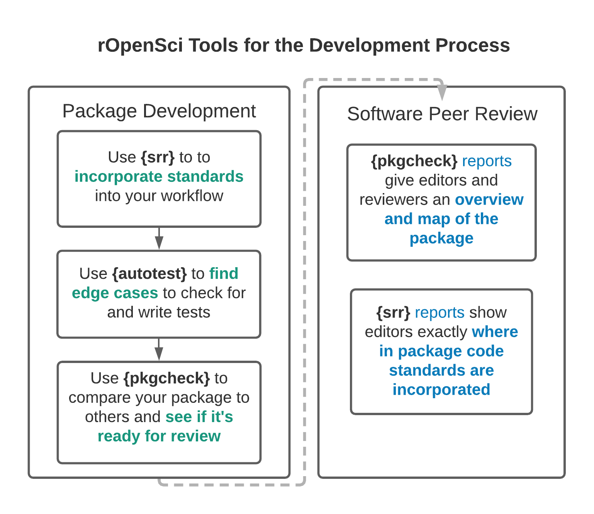

i# ropensci-review-tools

This organisation contains several packages developed for
[rOpenSci](https://ropensci.org)’s review process, and in particular for
the review of statistical software. The following diagram depicts the
relationships between some of the main packages:

Each package has it’s own repository, linked to below along with brief
descriptions.

## `srr`

The [`srr` package](https://github.com/ropensci-review-tools/srr) helps
authors document compliance with our [standards for statistical
software](https://stats-devguide.ropensci.org/standards.html) within
their actual code. The [package website](https://docs.ropensci.org/srr/)
has detailed descriptions of the procedure, including a [demonstration
which authors can first “walk through” to understand how the `srr`
package works](https://docs.ropensci.org/srr/articles/srr-stats.html).

## `autotest`

The [`autotest`
package](https://github.com/ropensci-review-tools/autotest) is intended
to be used from the first moments of package development, and throughout
the preparation of packages for submission to our peer review system. It
implements a form of mutation testing in an attempt to ensure all
parameters of all functions respond appropriately to as many different
forms and values of those parameters as possible. Continuous application
of [the `autotest`
package](https://github.com/ropensci-review-tools/autotest) throughout
package development should ensure review processes are much less likely
to uncover bugs in package behaviour.

# `pkgcheck`

The [`pkgcheck`
package](https://github.com/ropensci-review-tools/pkgcheck) represents
the final steps towards submitting a package for review with rOpenSci.
Authors should only need the one function,
[`pkgcheck()`](https://docs.ropensci.org/pkgcheck/reference/pkgcheck.html),
which will confirm whether or not a package is ready to be submitted.
The object returned by this function contains detailed information on
various aspects of a package.
